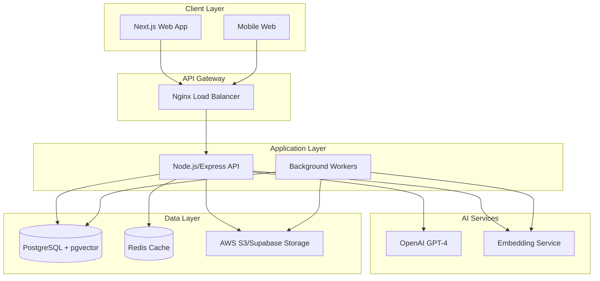
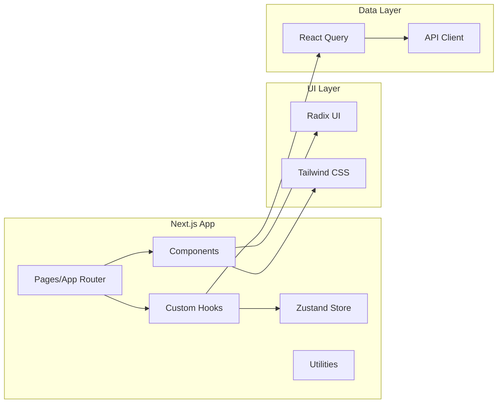
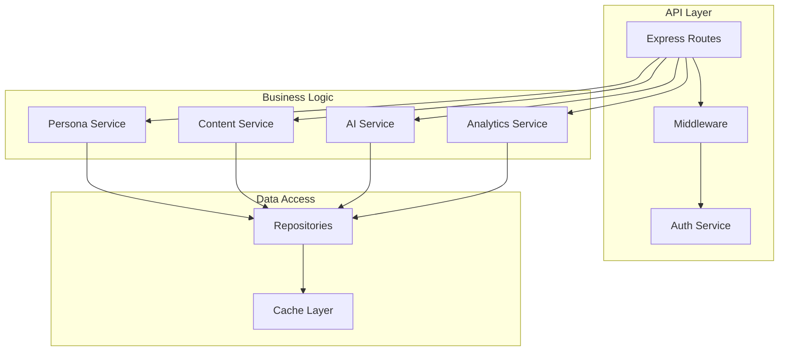
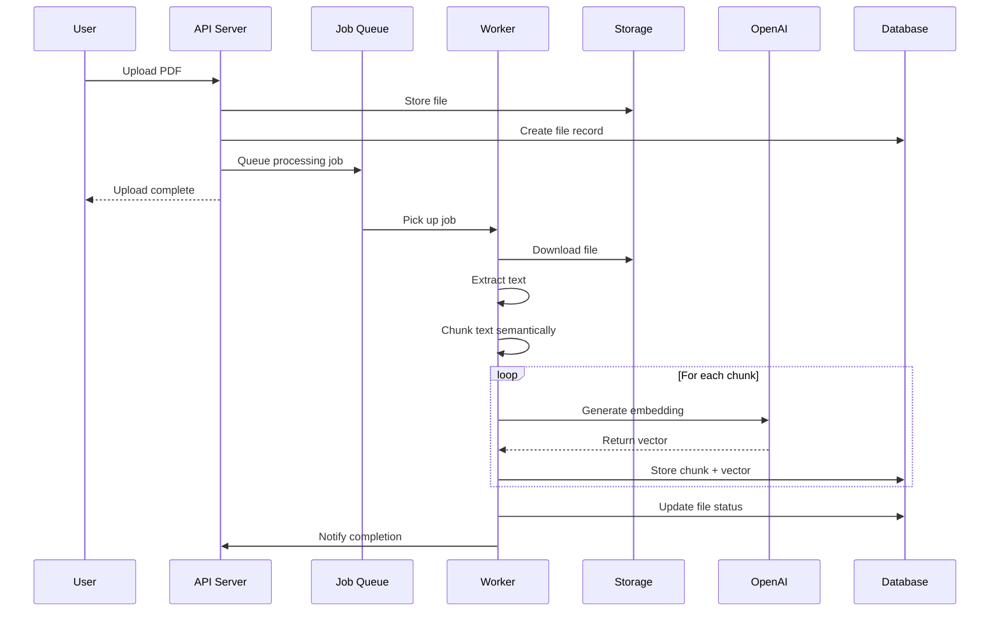
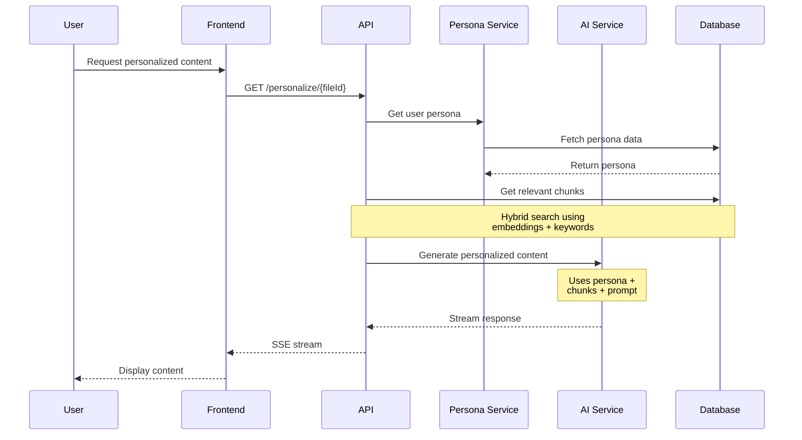
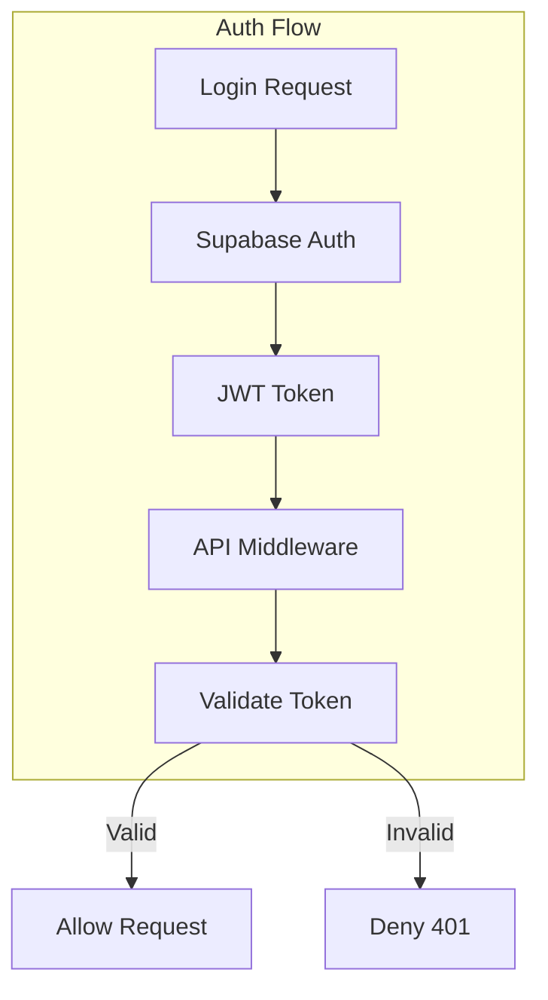
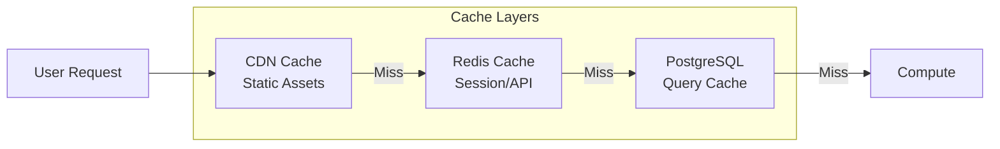
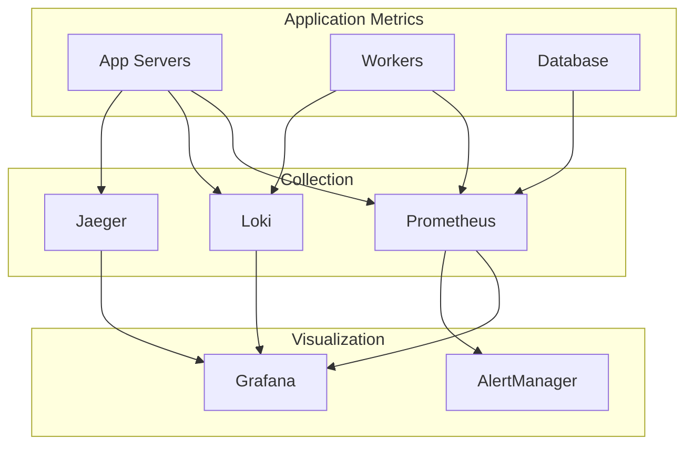
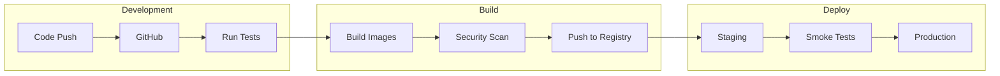
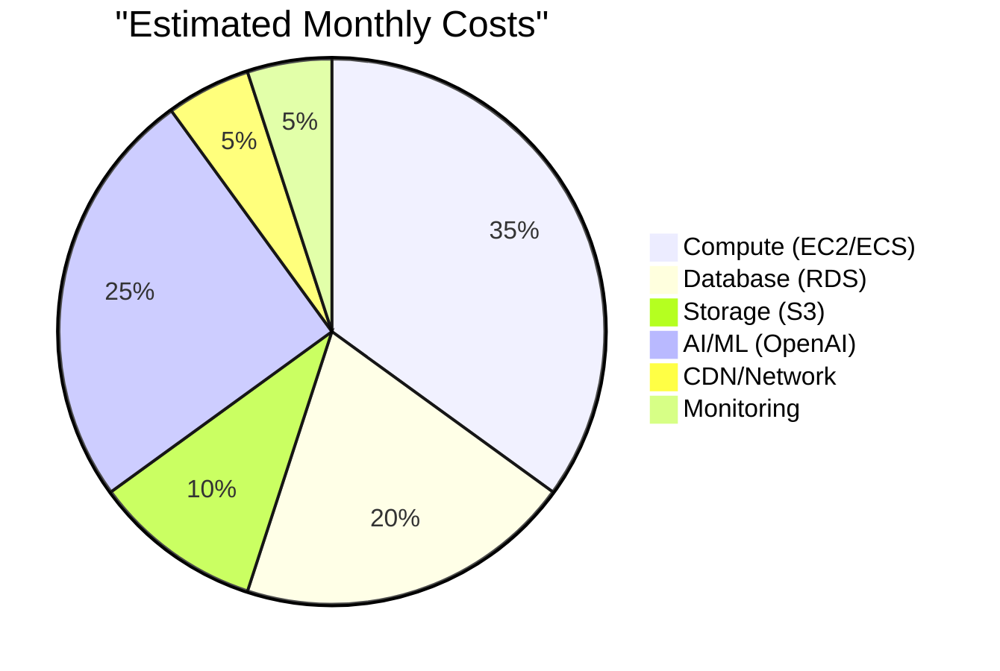

# LEARN-X Technical Architecture

## System Overview



## Component Architecture

### Frontend Architecture



### Backend Architecture



## Database Schema

### Core Tables

```sql
-- Users table
CREATE TABLE users (
    id UUID PRIMARY KEY DEFAULT gen_random_uuid(),
    email VARCHAR(255) UNIQUE NOT NULL,
    full_name VARCHAR(255),
    avatar_url TEXT,
    created_at TIMESTAMP WITH TIME ZONE DEFAULT CURRENT_TIMESTAMP,
    updated_at TIMESTAMP WITH TIME ZONE DEFAULT CURRENT_TIMESTAMP,
    last_login_at TIMESTAMP WITH TIME ZONE,
    subscription_tier VARCHAR(50) DEFAULT 'free',
    subscription_expires_at TIMESTAMP WITH TIME ZONE
);

-- User personas (core of personalization)
CREATE TABLE user_personas (
    id UUID PRIMARY KEY DEFAULT gen_random_uuid(),
    user_id UUID NOT NULL REFERENCES users(id) ON DELETE CASCADE,
    
    -- Professional Context
    current_role VARCHAR(255),
    industry VARCHAR(255),
    experience_years INTEGER,
    career_goals TEXT[],
    technical_level VARCHAR(50), -- beginner, intermediate, advanced
    
    -- Personal Interests
    primary_interests TEXT[],
    secondary_interests TEXT[],
    hobbies TEXT[],
    
    -- Learning Preferences
    learning_style VARCHAR(50), -- visual, auditory, reading, kinesthetic
    learning_style_strength DECIMAL(3,2), -- 0.0 to 1.0
    content_density VARCHAR(50), -- concise, balanced, comprehensive
    examples_per_concept INTEGER DEFAULT 2,
    
    -- Communication Style
    tone_preference VARCHAR(50), -- formal, professional, casual, friendly
    encouragement_level VARCHAR(50), -- minimal, moderate, high
    technical_comfort DECIMAL(3,2), -- 0.0 to 1.0
    
    created_at TIMESTAMP WITH TIME ZONE DEFAULT CURRENT_TIMESTAMP,
    updated_at TIMESTAMP WITH TIME ZONE DEFAULT CURRENT_TIMESTAMP,
    
    UNIQUE(user_id)
);

-- Courses
CREATE TABLE courses (
    id UUID PRIMARY KEY DEFAULT gen_random_uuid(),
    user_id UUID NOT NULL REFERENCES users(id) ON DELETE CASCADE,
    title VARCHAR(255) NOT NULL,
    description TEXT,
    color VARCHAR(7), -- hex color for UI
    icon VARCHAR(50), -- icon identifier
    created_at TIMESTAMP WITH TIME ZONE DEFAULT CURRENT_TIMESTAMP,
    updated_at TIMESTAMP WITH TIME ZONE DEFAULT CURRENT_TIMESTAMP,
    archived_at TIMESTAMP WITH TIME ZONE,
    
    INDEX idx_courses_user_id (user_id)
);

-- Modules within courses
CREATE TABLE modules (
    id UUID PRIMARY KEY DEFAULT gen_random_uuid(),
    course_id UUID NOT NULL REFERENCES courses(id) ON DELETE CASCADE,
    title VARCHAR(255) NOT NULL,
    description TEXT,
    order_index INTEGER NOT NULL,
    created_at TIMESTAMP WITH TIME ZONE DEFAULT CURRENT_TIMESTAMP,
    updated_at TIMESTAMP WITH TIME ZONE DEFAULT CURRENT_TIMESTAMP,
    
    INDEX idx_modules_course_id (course_id),
    UNIQUE(course_id, order_index)
);

-- Files/Documents
CREATE TABLE files (
    id UUID PRIMARY KEY DEFAULT gen_random_uuid(),
    module_id UUID NOT NULL REFERENCES modules(id) ON DELETE CASCADE,
    filename VARCHAR(255) NOT NULL,
    file_type VARCHAR(50) NOT NULL, -- pdf, docx, pptx, etc
    file_size_bytes BIGINT NOT NULL,
    storage_url TEXT NOT NULL,
    
    -- Processing status
    status VARCHAR(50) NOT NULL DEFAULT 'pending', -- pending, processing, completed, failed
    processing_started_at TIMESTAMP WITH TIME ZONE,
    processing_completed_at TIMESTAMP WITH TIME ZONE,
    processing_error TEXT,
    
    -- Extracted metadata
    page_count INTEGER,
    word_count INTEGER,
    extracted_topics TEXT[],
    difficulty_level VARCHAR(50),
    
    created_at TIMESTAMP WITH TIME ZONE DEFAULT CURRENT_TIMESTAMP,
    updated_at TIMESTAMP WITH TIME ZONE DEFAULT CURRENT_TIMESTAMP,
    
    INDEX idx_files_module_id (module_id),
    INDEX idx_files_status (status)
);

-- Document chunks with embeddings
CREATE TABLE document_chunks (
    id UUID PRIMARY KEY DEFAULT gen_random_uuid(),
    file_id UUID NOT NULL REFERENCES files(id) ON DELETE CASCADE,
    chunk_index INTEGER NOT NULL,
    chunk_text TEXT NOT NULL,
    
    -- Vector embedding for similarity search
    embedding vector(1536), -- OpenAI ada-002 dimension
    
    -- Metadata
    start_page INTEGER,
    end_page INTEGER,
    start_char INTEGER,
    end_char INTEGER,
    heading_context TEXT, -- parent headings
    chunk_type VARCHAR(50), -- paragraph, heading, list, table, etc
    
    created_at TIMESTAMP WITH TIME ZONE DEFAULT CURRENT_TIMESTAMP,
    
    INDEX idx_chunks_file_id (file_id),
    UNIQUE(file_id, chunk_index)
);

-- Create vector similarity index
CREATE INDEX idx_chunks_embedding ON document_chunks 
USING ivfflat (embedding vector_cosine_ops)
WITH (lists = 100);

-- Study sessions
CREATE TABLE study_sessions (
    id UUID PRIMARY KEY DEFAULT gen_random_uuid(),
    user_id UUID NOT NULL REFERENCES users(id) ON DELETE CASCADE,
    file_id UUID NOT NULL REFERENCES files(id) ON DELETE CASCADE,
    
    started_at TIMESTAMP WITH TIME ZONE DEFAULT CURRENT_TIMESTAMP,
    ended_at TIMESTAMP WITH TIME ZONE,
    duration_seconds INTEGER,
    
    -- Metrics
    concepts_covered TEXT[],
    questions_asked INTEGER DEFAULT 0,
    summaries_generated INTEGER DEFAULT 0,
    flashcards_created INTEGER DEFAULT 0,
    
    -- User feedback
    helpfulness_rating INTEGER CHECK (helpfulness_rating >= 1 AND helpfulness_rating <= 5),
    feedback_text TEXT,
    
    INDEX idx_sessions_user_id (user_id),
    INDEX idx_sessions_file_id (file_id)
);

-- AI interactions log
CREATE TABLE ai_interactions (
    id UUID PRIMARY KEY DEFAULT gen_random_uuid(),
    user_id UUID NOT NULL REFERENCES users(id) ON DELETE CASCADE,
    session_id UUID REFERENCES study_sessions(id) ON DELETE CASCADE,
    
    interaction_type VARCHAR(50) NOT NULL, -- question, summary, flashcard, explanation
    
    -- Request data
    user_input TEXT,
    context_chunks UUID[], -- references to document_chunks
    persona_snapshot JSONB, -- snapshot of user persona at time of request
    
    -- Response data
    ai_response TEXT NOT NULL,
    model_used VARCHAR(50) NOT NULL,
    prompt_tokens INTEGER,
    completion_tokens INTEGER,
    response_time_ms INTEGER,
    
    -- Feedback
    helpful BOOLEAN,
    
    created_at TIMESTAMP WITH TIME ZONE DEFAULT CURRENT_TIMESTAMP,
    
    INDEX idx_interactions_user_id (user_id),
    INDEX idx_interactions_session_id (session_id)
);

-- Learning progress tracking
CREATE TABLE learning_progress (
    id UUID PRIMARY KEY DEFAULT gen_random_uuid(),
    user_id UUID NOT NULL REFERENCES users(id) ON DELETE CASCADE,
    course_id UUID NOT NULL REFERENCES courses(id) ON DELETE CASCADE,
    module_id UUID REFERENCES modules(id) ON DELETE CASCADE,
    
    -- Progress metrics
    mastery_level DECIMAL(3,2) DEFAULT 0.0, -- 0.0 to 1.0
    time_spent_seconds INTEGER DEFAULT 0,
    last_accessed_at TIMESTAMP WITH TIME ZONE,
    
    -- Concept tracking
    concepts_introduced TEXT[],
    concepts_mastered TEXT[],
    weak_areas TEXT[],
    
    created_at TIMESTAMP WITH TIME ZONE DEFAULT CURRENT_TIMESTAMP,
    updated_at TIMESTAMP WITH TIME ZONE DEFAULT CURRENT_TIMESTAMP,
    
    INDEX idx_progress_user_course (user_id, course_id),
    UNIQUE(user_id, course_id, module_id)
);

-- User preferences and settings
CREATE TABLE user_settings (
    user_id UUID PRIMARY KEY REFERENCES users(id) ON DELETE CASCADE,
    
    -- Notification preferences
    email_summaries BOOLEAN DEFAULT true,
    email_frequency VARCHAR(50) DEFAULT 'weekly', -- daily, weekly, never
    
    -- UI preferences
    theme VARCHAR(50) DEFAULT 'light',
    font_size VARCHAR(50) DEFAULT 'medium',
    reduced_motion BOOLEAN DEFAULT false,
    high_contrast BOOLEAN DEFAULT false,
    
    -- Privacy settings
    analytics_enabled BOOLEAN DEFAULT true,
    share_progress BOOLEAN DEFAULT false,
    
    created_at TIMESTAMP WITH TIME ZONE DEFAULT CURRENT_TIMESTAMP,
    updated_at TIMESTAMP WITH TIME ZONE DEFAULT CURRENT_TIMESTAMP
);

-- Indexes for performance
CREATE INDEX idx_users_email ON users(email);
CREATE INDEX idx_files_created_at ON files(created_at);
CREATE INDEX idx_chunks_heading ON document_chunks USING gin(heading_context gin_trgm_ops);
CREATE INDEX idx_progress_updated ON learning_progress(updated_at);

-- Full text search
CREATE INDEX idx_chunks_text_search ON document_chunks USING gin(to_tsvector('english', chunk_text));

-- Triggers for updated_at
CREATE OR REPLACE FUNCTION update_updated_at_column()
RETURNS TRIGGER AS $$
BEGIN
    NEW.updated_at = CURRENT_TIMESTAMP;
    RETURN NEW;
END;
$$ language 'plpgsql';

CREATE TRIGGER update_users_updated_at BEFORE UPDATE ON users
    FOR EACH ROW EXECUTE FUNCTION update_updated_at_column();
    
CREATE TRIGGER update_personas_updated_at BEFORE UPDATE ON user_personas
    FOR EACH ROW EXECUTE FUNCTION update_updated_at_column();
    
CREATE TRIGGER update_courses_updated_at BEFORE UPDATE ON courses
    FOR EACH ROW EXECUTE FUNCTION update_updated_at_column();
```

## AI Pipeline Architecture

### Document Processing Flow



### Personalization Flow



## Security Architecture

### Authentication & Authorization



### Data Security Layers

1. **Network Security**
   - TLS 1.3 for all connections
   - Cloudflare DDoS protection
   - Rate limiting per user/IP

2. **Application Security**
   - JWT tokens with 1-hour expiry
   - Refresh token rotation
   - CORS properly configured
   - Input sanitization
   - SQL injection prevention via parameterized queries

3. **Data Security**
   - Encryption at rest (AES-256)
   - Row-level security in PostgreSQL
   - Signed URLs for file access (5-minute expiry)
   - PII data minimization

4. **Infrastructure Security**
   - VPC isolation
   - Security groups
   - Regular security updates
   - Audit logging

## Performance Optimization

### Caching Strategy



### Optimization Techniques

1. **Frontend Optimization**
   - Code splitting by route
   - Lazy loading components
   - Image optimization (WebP, AVIF)
   - Service worker for offline assets
   - Bundle size monitoring

2. **Backend Optimization**
   - Connection pooling
   - Batch embedding generation
   - Streaming responses
   - Query optimization
   - Horizontal scaling ready

3. **AI/ML Optimization**
   - Embedding cache (24-hour TTL)
   - Prompt template caching
   - Token usage monitoring
   - Fallback to GPT-3.5 for non-critical tasks

## Monitoring & Observability

### Metrics Collection



### Key Metrics to Monitor

1. **System Metrics**
   - Response time (p50, p95, p99)
   - Error rate by endpoint
   - Active users
   - Database connection pool
   - Queue depth

2. **Business Metrics**
   - Documents processed/hour
   - AI interactions/user/day
   - Personalization completion rate
   - User satisfaction scores
   - Conversion funnel

3. **AI Metrics**
   - Token usage by user tier
   - Model response times
   - Embedding generation rate
   - Content quality scores

## Deployment Architecture

### CI/CD Pipeline



### Infrastructure as Code

```yaml
# Example Terraform structure
terraform/
├── environments/
│   ├── staging/
│   │   ├── main.tf
│   │   └── variables.tf
│   └── production/
│       ├── main.tf
│       └── variables.tf
├── modules/
│   ├── network/
│   ├── compute/
│   ├── database/
│   └── storage/
└── shared/
    └── providers.tf
```

## Disaster Recovery

### Backup Strategy

1. **Database Backups**
   - Continuous replication to standby
   - Daily snapshots (30-day retention)
   - Point-in-time recovery (7 days)

2. **File Storage Backups**
   - Cross-region replication
   - Versioning enabled
   - 90-day retention

3. **Recovery Procedures**
   - RTO: 1 hour
   - RPO: 15 minutes
   - Automated failover for critical services
   - Documented runbooks

## Cost Optimization

### Resource Allocation



### Cost Control Measures

1. **Auto-scaling policies**
2. **Spot instances for workers**
3. **S3 lifecycle policies**
4. **API rate limiting**
5. **Embedding cache to reduce API calls**

---

This architecture is designed to be:
- **Scalable**: Horizontal scaling at every layer
- **Reliable**: Multiple redundancy and failover mechanisms
- **Performant**: Optimized for <2s response times
- **Secure**: Defense in depth approach
- **Cost-effective**: Pay for what you use with optimization built-in